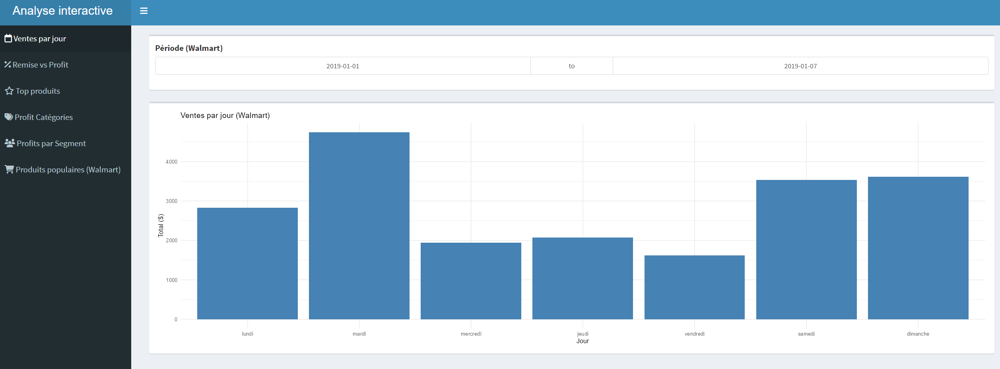
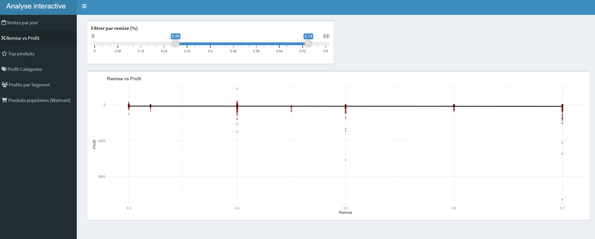
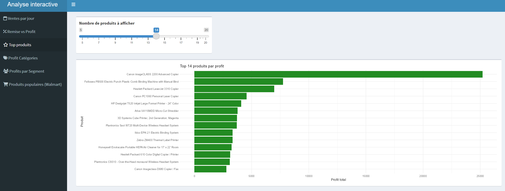
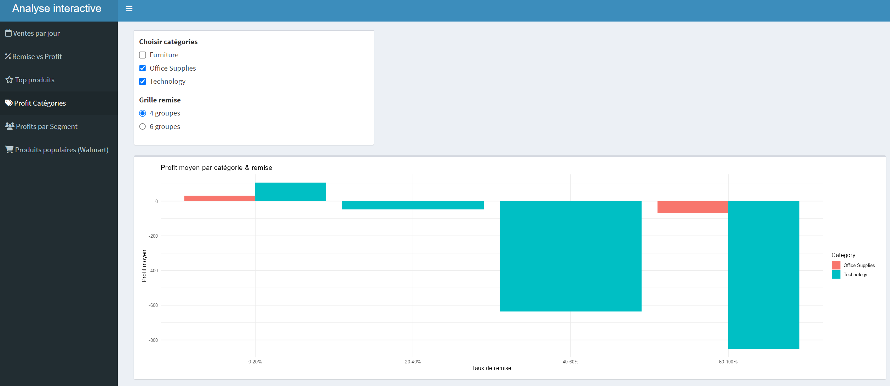
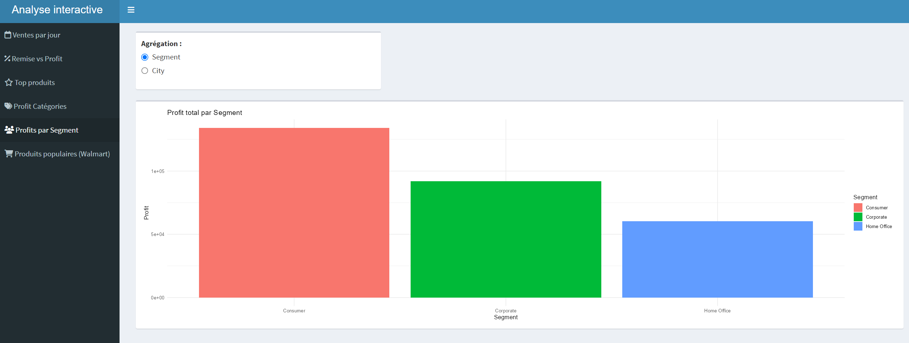
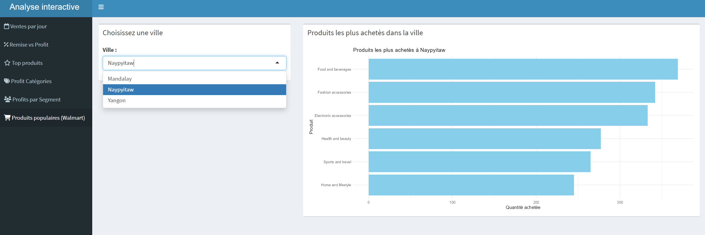

<style>
summary {
  cursor: pointer;
  font-size: 18px;
  font-weight: bold;
  padding: 12px 16px;
  background: linear-gradient(to right, #0072B5, #009E73); /* même style que la bannière */
  color: white;
  border: none;
  border-radius: 8px;
  margin: 20px 0 10px 0;
  box-shadow: 0 2px 4px rgba(0, 0, 0, 0.1);
  transition: background 0.3s ease;
}

details[open] summary {
  background: linear-gradient(to right, #009E73, #0072B5);
}

details {
  border: 1px solid #ccc;
  border-radius: 8px;
  padding: 10px 15px;
  background-color: #ffffff;
  box-shadow: 0 2px 6px rgba(0, 0, 0, 0.05);
  margin-bottom: 20px;
}

details strong {
  font-size: 17px;
  color: #007250; /* vert foncé harmonieux */
  display: block;
  margin-top: 10px;
  margin-bottom: 5px;
}
</style>


## Introduction

### Contexte et objectif

Dans le cadre de ce projet, nous avons travaillé avec **deux jeux de données différents mais complémentaires**. Ces données permettent d’explorer plusieurs aspects du commerce de détail : les ventes, les produits, les clients, la rentabilité, etc.

- Le premier fichier, appelé *Superstore*, regroupe presque 10 000 lignes de commandes passées dans une entreprise fictive de e-commerce.
- Le second fichier, basé sur des ventes dans des magasins Walmart, contient des données orientées “point de vente” : horaires, satisfaction client, modes de paiement...

L’objectif est de **mener une exploration** sur les données. Nous avons voulu comprendre comment ces systèmes fonctionnent, ce qui génère du profit ou non, et peut-être découvrir des profils de clients, des tendances d’achat ou des produits phares.  

## Structure et nature des données

####  [Données Superstore](https://www.kaggle.com/datasets/aksha17/superstore-sales)

Ce fichier CSV contient **9994 lignes** et **21 variables**. Il s’agit d’un historique de ventes avec des informations sur les commandes, les clients, les produits et la logistique.

**Variables numériques :**

- `Sales` : montant de la vente.
- `Quantity` : nombre d’unités vendues.
- `Discount` : remise appliquée.
- `Profit` : profit net.
- `Postal Code`, `Row ID` : identifiants.

**Variables temporelles :**

- `Order Date` : date de commande.
- `Ship Date` : date d’expédition.

**Variables nominales :**

- `Order ID`, `Customer ID`, `Product ID` : identifiants.
- `Customer Name` : nom du client.
- `Segment` : type de client.
- `Region`, `State`, `City` : localisation.
- `Ship Mode` : mode d’expédition.
- `Category`, `Sub-Category`, `Product Name` : classification des produits.


#### [Données Walmart](https://www.kaggle.com/datasets/antaesterlin/walmart-commerce-data)

Ce fichier CSV contient **1000 transactions** et **20 variables**. Il fournit des données détaillées sur chaque vente : prix, quantité, mode de paiement, heure, etc.

**Variables numériques :**

- `unit_price` : prix unitaire.
- `quantity` : quantité achetée.
- `vat` : taxe.
- `total` : montant total payé.
- `cogs` : coût du produit.
- `gross_margin_pct` : pourcentage de marge brute.
- `gross_income` : bénéfice.
- `rating` : note du client (sur 10).

**Variables temporelles :**

- `dtme` : date de la vente.
- `tme` : heure.
- `time_of_day` : moment (matin, après-midi...).
- `day_name`, `month_name` : jour et mois de l’achat.

**Variables nominales :**

- `invoice_id` : identifiant de facture.
- `branch`, `city` : lieu.
- `customer_type` : type de client.
- `gender` : genre.
- `product_line` : type de produit.
- `payment_method` : moyen de paiement.

## Chargement des packages et des données
```{r message=FALSE}
library(ggplot2)
library(dplyr)
library(readr)
library(lubridate)
library(ggcorrplot)
library(patchwork) # important pour combiner les plots
Sys.setlocale("LC_TIME", "fr_FR.UTF-8")

# Importer les données
superstore <- read_csv("data/superstore.csv")
walmart <- read_delim("data/Walmart.csv", delim = ";")


walmart_time <-walmart
walmart_total<-walmart
superstore_raw<- superstore
```


# Vue d’ensemble et corrélations entre variables

## Objectif

Avant de répondre aux différentes questions d’analyse, il est utile de commencer par une **vue d’ensemble** des jeux de données, afin de :

- Comprendre la structure globale (types de données, valeurs manquantes, distributions).
- Identifier des **relations entre variables numériques** à l’aide d’un graphique de corrélation.

Nous utilisons ici deux jeux de données :

- `Superstore` (ventes inter-entreprises B2B)
- `Walmart` (ventes aux particuliers B2C)

# Vue d'ensemble des deux jeu de données
```{r echo=FALSE, warning=FALSE}

# Corrélation Walmart
num_walmart <- walmart_total %>%
  select(where(is.numeric)) %>%
  na.omit()

cor_walmart <- cor(num_walmart)

ggcorrplot(cor_walmart, lab = TRUE, title = "Corrélation entre variables numériques (Walmart)")

```

```{r echo=FALSE}
# Corrélation Superstore
num_superstore <- superstore %>%
  select(where(is.numeric)) %>%
  na.omit()

cor_superstore <- cor(num_superstore)

ggcorrplot(cor_superstore, lab = TRUE, title = "Corrélation entre variables numériques (Superstore)")
```

- Une corrélation proche de 1 ou -1 indique un lien linéaire fort (positif ou négatif).

- Une valeur proche de 0 montre peu ou pas de relation.


<details> 
<summary><strong> Question 1: Quel est le genre des clients qui achetent le plus ?
</strong></summary>

1. Problématique

**Questions posées :**

- Quel est le genre des clients qui achetent le plus ?
- Comment les ventes varient-elles selon le segment de clientèle (Consumer, Corporate, Home Office) ?

**Réponse imaginée :**

On pourrait s’attendre à ce qu’un genre dépense légèrement plus que l’autre.

Concernant les segments, il est possible que les consommateurs génèrent plus de ventes que les autres catégories de clients.

- Titre : Dépenses par Genre (Walmart)
  
- Axes :
  - X : Genre (Female, Male)
  - Y : Montant total des dépenses

- Légende : Genre (rose pour Female, bleu pour Male)

- Outliers (points rouges)
- Médiane (trait central du boxplot)

**Graphique 2 (à droite) :**

- Titre : Montant des ventes par Segment (Superstore)
  
- Axes :
  - X : Segment (Consumer, Corporate, Home Office)
  - Y : Montant des ventes

- Légende : Segment (couleurs différentes pour chaque segment)
  - Outliers(points rouges)
  - Médiane représentée (trait central du boxplot)


```{r, echo = FALSE}

# Créer les deux graphiques
plot1 <- ggplot(walmart, aes(x = gender, y = total, fill = gender)) +
  geom_boxplot(outlier.color = "red", outlier.size = 1.5) +
  stat_summary(fun = mean, geom = "point", shape = 23, size = 4, fill = "yellow") +
  coord_cartesian(ylim = c(0, 1500)) +
  labs(title = "Ventes par genre de client") +
  theme_minimal()

plot2 <- ggplot(superstore, aes(x = Segment, y = Sales, fill = Segment)) +
  geom_boxplot(outlier.color = "red", outlier.size = 1.5) +
  stat_summary(fun = mean, geom = "point", shape = 23, size = 4, fill = "yellow") +
  coord_cartesian(ylim = c(0, 1500)) +
  labs(title = "Ventes par Segment de clients") +
  theme_minimal()

# Les afficher côte à côte
(plot1 + plot2) + 
  plot_layout(widths = c(1, 2))
```

**Analyse du premier graphique :**

En observant les dépenses par genre, on remarque que les femmes ont tendance à dépenser légèrement plus que les hommes, bien que la dispersion des dépenses soit assez similaire entre les deux groupes. Il y a également plusieurs points aberrants, ce qui suggère qu'il existe des clients ayant des dépenses particulièrement élevées dans les deux catégories. Cette différence de dépenses entre les genres semble donc présente, bien que limitée. Cependant, cela soulève une question intéressante : Quel rôle pourrait jouer le type de produit acheté dans ces écarts de dépenses ?

**Analyse du deuxième graphique :**

Pour le graphique des ventes par segment, on remarque que les médianes sont assez proches entre les segments "Consumer", "Corporate" et "Home Office". Cependant, la distribution des ventes est assez similaire pour tous les segments, avec une forte présence de points aberrants vers le haut. Le segment "Consumer" semble légèrement en tête, générant davantage de ventes élevées que les autres. Cela dit, les différences entre les segments ne sont pas énormes.
</details>


<details> 
<summary><strong>Question 2: Est-ce que certains jours génèrent plus de ventes que d'autres ?
</strong></summary>

Nous souhaitons comprendre si certains jours de la semaine influencent le volume de ventes. Pour cela, nous analysons deux jeux de données : Superstore, qui concerne les ventes entre entreprises (B2B), et Walmart, qui concerne les ventes aux particuliers (B2C). L’objectif est d’identifier des tendances journalières dans le comportement d’achat.

Nous faisons l’hypothèse suivante :

- Pour Superstore, les ventes seront majoritairement concentrées en semaine, car les commandes inter-entreprises se font généralement pendant les jours ouvrés.

- Pour Walmart, les ventes seront plus élevées le week-end, car les particuliers ont davantage de temps libre pour faire leurs achats.

**Superstore - Ventes par jour de la semaine**
```{r, echo = FALSE}
superstore <- superstore %>%
  mutate(Order_Date = as.Date(`Order Date`, format="%d-%m-%y"),
         DayOfWeek = weekdays(Order_Date)) %>%
  group_by(DayOfWeek) %>%
  summarise(Total_Sales = sum(Sales, na.rm = TRUE))

superstore$DayOfWeek <- factor(superstore$DayOfWeek,
                               levels = c("lundi", "mardi", "mercredi", "jeudi", "vendredi", "samedi", "dimanche"))

ggplot(superstore, aes(x = DayOfWeek, y = Total_Sales, group = 1)) +
  geom_line(color = "steelblue", linewidth = 1.2) +  # 🔁 ici, on remplace size par linewidth
  geom_point(color = "darkblue", size = 3) +
  geom_text(aes(label = round(Total_Sales, 0)), vjust = -1) +
  labs(title = "Superstore : Évolution des ventes par jour",
       x = "Jour", y = "Ventes ($)") +
  theme_minimal()
```

**Walmart - Ventes par jour de la semaine**

```{r, echo = FALSE}

walmart <- walmart %>%
  mutate(
    dtme = as.Date(dtme),
    DayOfWeek = weekdays(dtme)
  ) %>%
  group_by(DayOfWeek) %>%
  summarise(Total_Sales = sum(total, na.rm = TRUE))

walmart$DayOfWeek <- factor(walmart$DayOfWeek,
                            levels = c("lundi", "mardi", "mercredi", "jeudi", "vendredi", "samedi", "dimanche"))

ggplot(walmart, aes(x = DayOfWeek, y = Total_Sales, group = 1)) +
  geom_line(color = "darkgreen", linewidth = 1.2) +  # Remplace `size` par `linewidth`
  geom_point(color = "forestgreen", size = 3) +
  geom_text(aes(label = round(Total_Sales, 0)), vjust = -1) +
  labs(title = "Walmart : Évolution des ventes par jour de la semaine",
       x = "Jour", y = "Ventes ($)") +
  theme_minimal()
```
**Analyse**
L’analyse des ventes par jour de la semaine révèle des comportements distincts entre Superstore et Walmart. Pour Superstore, les ventes culminent le lundi et le vendredi, tandis que le mercredi enregistre un net creux. Cela s’explique par son modèle B2B : les entreprises passent commande en début de semaine pour lancer leur activité, et en fin de semaine pour anticiper la suivante. Les ventes du week-end restent élevées, mais légèrement inférieures. À l’inverse, Walmart, orienté B2C, enregistre ses meilleures ventes le samedi, suivi du mardi et du dimanche, reflet du comportement des particuliers qui profitent de leur temps libre le week-end pour faire leurs achats. En semaine, les ventes sont plus faibles, contraintes par les obligations professionnelles ou scolaires.
</details>


<details> 
<summary><strong>Question 3 : Est-ce qu’une réduction fait toujours gagner de l’argent ?
</strong></summary>

**Réflexion initiale**

Nous nous sommes posé la question suivante : **Accorder une remise sur une vente assure-t-il toujours un bénéfice ?**  
Intuitivement, nous avons supposé que si la remise est modérée, elle pourrait stimuler les ventes sans trop impacter le profit ; mais qu'une remise trop importante risquerait au contraire de générer des pertes.

Pour valider ou invalider cette intuition, nous avons décidé de suivre une démarche en deux temps :  
- Visualiser la relation globale entre le taux de remise et le profit.  
- Approfondir l'analyse en étudiant la distribution du profit pour différents niveaux de remise.


**Méthode**

1. Analyse exploratoire initiale :  Nous utilisons d'abord un scatter plot combiné à une courbe de régression linéaire pour observer la tendance globale entre le taux de remise et le profit.

2. Approfondissement avec une analyse catégorielle :  Afin d'aller plus loin et mieux comprendre l'impact des différents niveaux de remise, nous introduisons un boxplot par groupe de taux de remise.

Pourquoi utiliser également un boxplot ?  
- Le boxplot nous permet d'analyser plus précisément la distribution du profit dans chaque catégorie de remise, en visualisant la médiane, les quartiles et les valeurs atypiques.  
- Cela apporte une vision plus claire et comparative entre les différents niveaux de remise.


**Visualisation**

**Partie 1 - Scatter plot : Discount vs Profit**

```{r message=FALSE, echo = FALSE}
library(ggplot2)
library(dplyr)
library(readr)

# Lire les données Superstore
superstore <- read_csv("data/superstore.csv", show_col_types = FALSE)

# Visualiser Discount vs Profit avec une courbe de tendance
ggplot(superstore, aes(x = Discount, y = Profit)) +
  geom_point(alpha = 0.5) +
  geom_smooth(method = "lm", color = "blue", se = FALSE) +
  labs(title = "Relation entre Discount et Profit (Superstore)",
       x = "Taux de remise (Discount)",
       y = "Profit ($)") +
  theme_minimal()
```


**Partie 2 - Boxplot : Profit par groupe de Discount**

```{r, echo = FALSE}
# Nettoyer les données
superstore_clean <- superstore %>%
  filter(!is.na(Discount), !is.na(Profit))

# Créer des groupes de Discount
superstore_clean <- superstore_clean %>%
  mutate(Discount_Group = case_when(
    Discount == 0 ~ "0%",
    Discount > 0 & Discount <= 0.2 ~ "0%-20%",
    Discount > 0.2 & Discount <= 0.4 ~ "20%-40%",
    Discount > 0.4 & Discount <= 0.6 ~ "40%-60%",
    Discount > 0.6 ~ "60%-80%"
  ))

# Visualiser Boxplot
ggplot(superstore_clean, aes(x = Discount_Group, y = Profit, fill = Discount_Group)) +
  geom_boxplot() +
  labs(title = "Distribution du profit selon le taux de remise",
       x = "Catégorie de remise",
       y = "Profit ($)") +
  theme_minimal() +
  theme(legend.position = "none")
```


**Analyse**

Les deux graphiques montrent un lien clair entre le taux de remise et le profit.

Scatter plot : il révèle une tendance globale négative — plus la remise est élevée, plus le profit diminue.

Boxplot : il précise cette relation. Jusqu’à 20 %, les profits sont majoritairement positifs. Entre 20 % et 40 %, la rentabilité chute. Au-delà de 40 %, la médiane devient négative et la variabilité augmente fortement.

Différences entre les deux graphiques
Le scatter plot aide à voir la tendance générale.

Le boxplot permet de comparer finement les niveaux de remise, en mettant en évidence la médiane, la dispersion et les valeurs extrêmes.
</details>


<details> 
<summary><strong>Question 4 :Quels produits rapportent le plus ?
</strong></summary>

**Méthode**

Pour répondre à cette question,Nous nous concentrerons principalement sur deux paramètres : 
**product_line** : ce paramètre nous informe sur le type de produit, et **gross_income** : ce paramètre nous indique le bénéfice généré par le produit.

Nous utiliserons un diagramme en barres pour analyser les données, car les catégories de produits possèdent plusieurs étiquettes différentes, tandis que le revenu des produits est une valeur unique. Après avoir trié les données, la comparaison entre les produits sera également plus intuitive.

**Visualisation**

**Bar chart: product_line et gross_income**

```{r message=FALSE, echo = FALSE}
library(dplyr)
library(readr)
library(ggplot2)
library(scales)

data <- read_delim(
  "data/Walmart.csv",
  delim = ";", 
  show_col_types = FALSE
)

result <- data %>%
  group_by(product_line) %>%
  summarise(total_gross_income = sum(gross_income, na.rm = TRUE)) %>%
  arrange(desc(total_gross_income))


ggplot(result, aes(x = reorder(product_line, total_gross_income), y = total_gross_income)) +
  geom_bar(stat = "identity", fill = "steelblue") +
  coord_flip() + 
  labs(title = "Revenu total par catégorie de produits",
       x = '',
       y = "Revenu brut (en dollars)") +
  scale_y_continuous(labels = dollar) +
  geom_text(aes(label = dollar(total_gross_income)), 
            position = position_stack(vjust = 0.5),
            size = 4, color = "white") +  
  theme_minimal()
```


**Résultat et Conclusion**

Nous pouvons observer que les produits du supermarché Walmart sont répartis en six catégories. Parmi celles-ci, la vente de food and beverages génère le bénéfice le plus élevé, tandis que health and beauty génère le bénéfice le plus faible.
Toutefois, il est important de noter que l'écart entre eux n'est pas très important. Pour certains produits, la différence de bénéfices ne dépasse même pas 2%. De plus, tous les bénéfices dépassent 2000 dollars. Étant donné que les données collectées peuvent être influencées par le contexte social et d'autres facteurs à l'époque, nous pouvons conclure qu'au premier trimestre de 2019, la vente de food and beverages générait les bénéfices les plus élevés.
</details>


<details> 
<summary><strong>Question 5 : Quelles catégories perdent de l’argent avec les réductions ?
</strong></summary>

Pour répondre à cette question, nous allons utiliser le dataset Superstore, qui contient des informations sur les remises, profits et catégories de produits.
Nous chercherons à analyser l'effet des niveaux de remise sur le profit moyen par catégorie, afin d’identifier celles qui deviennent non rentables lorsque des réductions sont appliquées.

**Visualisation**

```{r message=FALSE, warning=FALSE, echo = FALSE}
# Nettoyage des données : s'assurer qu'il n'y a pas de NA dans les variables clés
superstore_clean <- superstore %>%
  filter(!is.na(Discount), !is.na(Profit), !is.na(Category))

# Calculer le profit moyen par catégorie selon les niveaux de remise
profit_by_discount <- superstore_clean %>%
  mutate(remise = case_when(
    Discount == 0 ~ "0%",
    Discount > 0 & Discount <= 0.2 ~ "0-20%",
    Discount > 0.2 & Discount <= 0.4 ~ "20-40%",
    Discount > 0.4 ~ ">40%"
  )) %>%
  group_by(Category, remise) %>%
  summarise(profit_moyen = mean(Profit), .groups = "drop")

# Visualisation
ggplot(profit_by_discount, aes(x = remise, y = profit_moyen, fill = Category)) +
  geom_col(position = "dodge") +
  labs(
    title = "Profit moyen par niveau de remise et catégorie",
    x = "Niveau de remise",
    y = "Profit moyen",
    fill = "Catégorie"
  ) +
  theme_minimal()
```

**Analyse**

On observe que toutes les catégories deviennent non rentables lorsque la remise dépasse 40%. En particulier, la catégorie Technology affiche une perte moyenne très importante, proche de -800.

La catégorie Furniture enregistre également des pertes dès le niveau de 20–40% de remise, avec un profit moyen négatif.

En revanche, des remises plus faibles (entre 0 et 20%) restent généralement rentables pour toutes les catégories, notamment Technology, qui affiche un profit moyen positif dans cette tranche.

Cela suggère que les remises élevées (> 40%) sont globalement désavantageuses, et que leur impact varie fortement selon la catégorie de produit.
</details>


<details> 
<summary><strong>Question 6 :Les choses chères sont-elles mieux notées ?
</strong></summary>

**Méthode**

Pour répondre à cette question, nous nous concentrerons principalement sur deux paramètres : 
**unit_price** : ce paramètre indique le prix unitaire des produits, et **rating** : ce paramètre reflète la satisfaction des clients à travers leur évaluation.

Nous utiliserons un diagramme de dispersion pour analyser les données. Bien que le prix et la note soient des variables numériques, ils peuvent être considérés comme discrétisables afin de mieux visualiser leur relation. En observant la distribution des points, nous pourrons déterminer s’il existe une tendance entre le prix et la note, par exemple si les produits plus chers sont mieux notés ou s’il n’y a pas de lien clair.

**Visualisation**

**Scatter: Unit_price et rating**
```{r echo=FALSE, message=FALSE, warning=FALSE}

ggplot(data, aes(x = unit_price, y = rating)) +
  geom_point(alpha = 0.6, color = "steelblue") +
  labs(title = "Scatter Plot of Unit Price vs Rating",
       x = "Unit Price",
       y = "Rating") +
  theme_minimal()
```


**Résultat et Conclusion**

Si les produits plus chers avaient tendance à être mieux notés, les points seraient approximativement alignés en bande sur le graphique. Cependant, en observant le nuage de points, on constate que les données sont réparties de manière assez uniforme et désordonnée sur l'ensemble du graphique. On peut donc conclure qu’il n’existe pas de relation directe entre le prix unitaire et la note.
De plus, nous avons remarqué une observation intéressante : quelle que soit la valeur du prix unitaire, la note attribuée est toujours supérieure ou égale à 4.
</details>


<details> 
<summary><strong>Question 8 : Est-ce qu’un long délai de livraison fait perdre de l’argent ?
</strong></summary>

**Méthode**

Nous cherchons à savoir si les délais de livraison ont un impact sur le profit généré par une vente. Autrement dit, est-ce que livrer plus lentement fait perdre de l'argent à l'entreprise ?

Nous pensons que plus le délai entre commande et expédition est long, plus cela engendre des coûts supplémentaires, ce qui pourrait réduire le profit. Nous allons visualiser cette relation à l’aide d’un nuage de points accompagné d’une courbe de tendance linéaire.

**Visualisation : Délai de livraison vs Profit**

```{r echo=FALSE}
library(lubridate)
library(ggplot2)
library(dplyr)
library(readr)

superstore <- superstore_raw %>%
  mutate(Order_Date = as.Date(`Order Date`, format="%d-%m-%y"),
         Ship_Date = as.Date(`Ship Date`, format="%d-%m-%y"),
         Delivery_Days = as.numeric(difftime(Ship_Date, Order_Date, units = "days")))

# Visualisation
ggplot(superstore, aes(x = factor(Delivery_Days), y = Profit)) +
  geom_boxplot(fill = "lightblue") +
  labs(title = "Profit par délai de livraison (Superstore)",
       x = "Délai de livraison (jours)",
       y = "Profit ($)") +
  theme_minimal()

```

**Analyse**

À partir du graphique, on observe :

- Le profit est très variable, quel que soit le nombre de jours de livraison.

- Aucune tendance claire n’indique qu’un délai plus long entraîne une baisse systématique du profit.

- La majorité des profits, quelle que soit la durée, restent autour de zéro.

Interprétation :

- Le délai de livraison ne semble pas avoir d’effet direct sur la rentabilité.

- D’autres facteurs (comme les frais de port, la catégorie de produit ou la réduction) influencent probablement davantage le profit que la durée de livraison seule.
</details>


<details> 
<summary><strong>Question 9 – Quelle catégorie a la plus grosse marge ?
</strong></summary>

Pour répondre à cette question, nous allons analyser le dataset **Superstore**, en nous concentrant sur la **marge bénéficiaire totale** (Profit) pour chaque **catégorie de produit**.  
Nous allons visualiser la répartition des profits à l’aide d’un graphique circulaire (pie chart), afin d’identifier la catégorie la plus rentable.

**Visualisation**

```{r message=FALSE, warning=FALSE, echo = FALSE}

Sys.setlocale("LC_ALL", "fr_FR.UTF-8")

# Nettoyage des données
superstore_clean <- superstore %>%
  filter(!is.na(Category), !is.na(Profit))

# Calcul du profit total par catégorie
marge_par_categorie <- superstore_clean %>%
  group_by(Category) %>%
  summarise(marge_totale = sum(Profit), .groups = "drop") %>%
  mutate(pourcentage = marge_totale / sum(marge_totale) * 100,
         etiquette = paste0(Category, " (", round(pourcentage, 1), "%)"))

# Visualisation
ggplot(marge_par_categorie, aes(x = "", y = marge_totale, fill = Category)) +
  geom_col(width = 1, color = "white") +
  coord_polar(theta = "y") +
  geom_text(aes(label = etiquette), position = position_stack(vjust = 0.5), size = 4) +
  labs(
    title = "Répartition des marges par catégorie",
    fill = "Catégorie"
  ) +
  theme_void()

```

**Analyse**
Le graphique montre la répartition des marges (profits totaux) entre les trois catégories de produits.

On observe que :

La catégorie Technology génère la plus grosse marge, représentant 50,8 % de la marge totale. Cela indique une forte rentabilité globale de cette catégorie, malgré les pertes occasionnelles en cas de fortes remises.

La catégorie Office Supplies arrive en deuxième position avec 42,8 % des marges. Elle semble relativement stable en termes de rentabilité.

En revanche, la catégorie Furniture ne représente que 6,4 % des marges totales, ce qui souligne une faible contribution au profit global de l’entreprise. Cette faible marge peut s’expliquer par une sensibilité plus forte aux remises ou des coûts plus élevés.

En résumé, la technologie est le moteur principal de la rentabilité, tandis que le mobilier semble le moins performant sur le plan des marges.
</details>


<details> 
<summary><strong>Question 10 :Quel moment de la journée rapporte le plus ?
</strong></summary>

**Méthode**

Pour répondre à cette question, nous nous concentrerons principalement sur deux paramètres :
**time_of_day** : ce paramètre indique le moment de la journée où l’achat a été effectué, et
**gross_income** : ce paramètre représente le revenu brut généré par la transaction.

Nous allons utiliser le graphique en Dount Chart pour analyser les données, car il est plus facile de visualiser le pourcentage des revenus au fil du temps pour différentes périodes. En comparant le revenu total généré à chaque moment de la journée, nous serons en mesure d’identifier les périodes les plus rentables et ainsi déterminer quel moment de la journée rapporte le plus d’argent.


**Visualisation**

**Bar chart: time_of_day et gross_income**
```{r echo=FALSE, message=FALSE, warning=FALSE, error=FALSE}

income_by_time <- data %>%
  group_by(time_of_day) %>%
  summarise(total_income = sum(gross_income, na.rm = TRUE)) %>%
  arrange(desc(total_income))

income_by_time$time_of_day <- factor(income_by_time$time_of_day,
                                     levels = c("morning", "afternoon", "evening"))
income_by_time <- income_by_time %>%
  mutate(percent = total_income / sum(total_income) * 100,
         label = paste0(round(percent, 1), "%\n$", round(total_income, 1)))

ggplot(income_by_time, aes(x = 2, y = total_income, fill = time_of_day)) +
  geom_bar(stat = "identity", width = 1, color = "white") +
  coord_polar(theta = "y", start = 0) +
  xlim(0.5, 2.5) +
  geom_text(aes(label = label), position = position_stack(vjust = 0.5), color = "white") +
  labs(title = "Répartition du revenu par tranche horaire de la journée") +
  theme_void() +
  theme(legend.title = element_blank())
```

**Résultat et Conclusion**

D’après le diagramme en barres, on peut clairement observer que les ventes du matin génèrent le moins de bénéfices, suivies de l’après-midi, tandis que les ventes du soir rapportent le plus. De plus, les bénéfices du matin représentent moins de la moitié de ceux de l’après-midi, alors que la différence entre l’après-midi et le soir n’est pas très marquée.

Cela m’a fait penser au cours Éthique et biais de visualisation : comme les tranches horaires du champ time_of_day sont déjà prédéfinies dans le jeu de données, nous ne connaissons pas la répartition exacte des heures. Il est donc possible que, si l’intervalle de l’après-midi avait été légèrement élargi lors de la collecte des données, cela aurait pu inverser les résultats et faire apparaître l’après-midi comme la période la plus rentable. Ce constat est assez intéressant.
</details>


<details> 
<summary><strong>Question 12 : Quels États font le plus de ventes ?
</strong></summary>

**Méthode**

Nous voulons identifier les régions géographiques les plus actives commercialement, en mesurant la valeur totale des ventes par État dans le jeu de données Superstore.

Nous supposons que certains États génèrent beaucoup plus de ventes que d'autres, possiblement en raison de leur population, leur pouvoir d'achat ou leur position géographique stratégique. Une représentation en barplot des ventes totales par État nous permettra de visualiser cette répartition.

**Visualisation : Ventes par État**

```{r echo=FALSE}
state_sales <- superstore %>%
  group_by(State) %>%
  summarise(Total_Sales = sum(Sales, na.rm = TRUE)) %>%
  arrange(desc(Total_Sales))

ggplot(state_sales, aes(x = reorder(State, Total_Sales), y = Total_Sales)) +
  geom_col(fill = "steelblue") +
  coord_flip() +
  labs(title = "Total des ventes par État (Superstore)",
       x = "État",
       y = "Ventes ($)") +
  theme_minimal()
```

**Analyse**

Le graphique met en évidence des écarts très marqués entre les États :

- Californie est de loin l’État avec le plus grand volume de ventes, suivie par New York et Texas.

- Un petit groupe d’États concentre l’essentiel du chiffre d’affaires.

- La majorité des autres États génèrent des ventes beaucoup plus faibles, parfois presque négligeables.

Interprétation :

- Les États en tête sont généralement plus peuplés, plus riches ou plus densément urbanisés, ce qui favorise l’activité commerciale.

- Cette concentration peut guider les décisions marketing ou logistiques (ciblage, stock, implantation de centres de distribution).
</details>


<details> 
<summary><strong>Question 13 :Quelle région est la plus performante en termes de rentabilité ?
</strong></summary>

**Méthode**
Pour cette analyse, nous avons utilisé le jeu de données Superstore, en nous concentrant sur trois variables clés :

Region : la région géographique (East, West, South, Central)

Sales : le chiffre d’affaires

Profit : le bénéfice

Nous avons procédé en deux étapes :

Agrégation des données par région, pour obtenir :

Le total des ventes

Le total des profits

La marge bénéficiaire (Profit / Sales)

Visualisation via un treemap :

La taille de chaque bloc représente le volume des ventes

La couleur reflète la marge bénéficiaire

Un code couleur du rouge (moins rentable) au vert (plus rentable) facilite l’interprétation visuelle

**Visualisation**

```{r echo=FALSE, message=FALSE, warning=FALSE, error=FALSE}
if (!requireNamespace("treemapify", quietly = TRUE)) {
  install.packages("treemapify")
}

library(treemapify)

# Préparation des données : calcul par région
region_profitability <- superstore %>%
  filter(!is.na(Sales), !is.na(Profit), !is.na(Region)) %>%
  group_by(Region) %>%
  summarise(
    total_sales = sum(Sales),
    total_profit = sum(Profit),
    profit_margin = total_profit / total_sales,
    .groups = "drop"
  )

# Treemap avec des couleurs plus douces
ggplot(region_profitability, 
       aes(area = total_sales, 
           fill = profit_margin, 
           label = paste0(Region, "\n", round(profit_margin*100, 1), "%"))) +
  geom_treemap() +
  geom_treemap_text(colour = "white", place = "centre", grow = TRUE, reflow = TRUE) +
  scale_fill_gradient2(
    low = "#B22222",    
    mid = "#F0E68C",    
    high = "#228B22",   
    midpoint = mean(region_profitability$profit_margin),
    name = "Marge bénéficiaire"
  ) +
  labs(title = "Rentabilité par région (taille = ventes, couleur = marge)") +
  theme_minimal()


```

**Analyse**
La région West se démarque nettement avec la plus forte marge bénéficiaire : 14.9%.

Elle est suivie par East (13.5%) et South (11.9%), qui présentent également une rentabilité raisonnable.

En revanche, la région Central affiche la rentabilité la plus faible, avec une marge de seulement 7.9%.

En termes de volume de ventes (taille des blocs), East et West ont des ventes plus importantes que South et Central, ce qui signifie qu’elles combinent à la fois volume et rentabilité.

Le treemap permet ici une visualisation doublement efficace : il nous montre où se réalisent les ventes et dans quelle mesure ces ventes sont profitables.

Cette analyse suggère que pour maximiser la rentabilité, l’entreprise pourrait étudier les pratiques commerciales mises en œuvre dans la région West, et envisager des actions correctives dans la région Central.
</details>

<details> 
<summary><strong> Question 14 : Quels produits sont beaucoup achetés ?
</strong></summary>

**Données utilisées** : `product_line` et `quantity` (jeu de données Walmart)

---

**Méthode**

Pour répondre on a:

- Utiliser **product_line** pour identifier les produits.
- Utiliser **quantity** pour mesurer combien de fois chaque produit a été acheté.
- Additionner les quantités par type de produit.
- Classer les produits du plus acheté au moins acheté

---

**Visualisation : Produits les plus achetés**

```{r, echo = FALSE}
library(dplyr)
superstore <- read_csv("data/superstore.csv")
walmart <- read_delim("data/Walmart.csv", delim = ";")

walmart_time <-walmart
walmart_total<-walmart
superstore_raw<- superstore

# Calculer la quantité totale par type de produit
produits_walmart <- walmart %>%
  group_by(product_line) %>%
  summarise(Total_Quantity = sum(quantity, na.rm = TRUE)) %>%
  arrange(desc(Total_Quantity))

# Créer le graphique
ggplot(produits_walmart, aes(x = reorder(product_line, Total_Quantity), y = Total_Quantity)) +
  geom_col(fill = "skyblue") +
  coord_flip() +
  labs(title = "Produits les plus achetés chez Walmart",
       x = "Produit",
       y = "Quantité totale achetée") +
  theme_minimal()
```
</details>

<details> 
<summary><strong>Question 15 :Est-ce que la façon de payer change le prix moyen ?
</strong></summary>

**Méthode**

Pour répondre à cette question, nous allons nous concentrer sur deux paramètres :

**payment_method** : ce paramètre indique le mode de paiement utilisé par le client.

**total**: ce paramètre représente le montant total payé par le client lors de l’achat.

Nous allons utiliser un diagramme en boîte (boxplot) pour visualiser la distribution des montants en fonction des différentes méthodes de paiement. Le boxplot permet de représenter de manière claire la médiane, les quartiles ainsi que les valeurs aberrantes, ce qui nous aide à déterminer si certains moyens de paiement sont associés à des niveaux de dépenses différents, et donc si la méthode de paiement a une influence sur le montant payé par les clients.


**Visualisation**

**Boxplot: payment_method et total**
```{r echo=FALSE, message=FALSE, warning=FALSE, error=FALSE}


ggplot(data, aes(x = payment_method, y = total, fill = payment_method)) +
  geom_boxplot(alpha = 0.7) +
  labs(title = "Répartition du montant total des dépenses selon les différents modes de paiement",
       x = "payment_method",
       y = "Total") +
  theme_minimal() +
  theme(legend.position = "none")
```


**Résultat et Conclusion**
Les trois méthodes de paiement (espèces, portefeuille électronique, carte de crédit) ne présentent pas de différences significatives en termes de montant moyen payé, leurs médianes étant relativement proches.
La distribution des montants est également similaire entre les différentes méthodes, avec un nombre et une répartition des valeurs aberrantes globalement comparables.
Par conséquent, on peut considérer qu’il n’y a pas d’influence notable de la méthode de paiement sur le montant moyen des achats.
</details>

<details> 
<summary><strong> Question 16 : Quelles sous-catégories ne rapportent pas ?
</strong></summary>

Nous cherchons ici à identifier les **sous-catégories de produits** (dans Superstore) qui génèrent **des pertes** ou **un profit très faible**. Cela peut aider à décider s’il faut arrêter certains produits, revoir leur prix ou repenser les campagnes marketing.

Pour cela, nous allons agréger les profits par sous-catégorie, puis les visualiser dans un diagramme à barres. Les sous-catégories non rentables apparaîtront en rouge.

**Superstore - Profit total par sous-catégorie**

```{r, echo = FALSE, message = FALSE, warning = FALSE}
library(tidyverse)

# Nettoyage du nom de colonne s'il contient des tirets
names(superstore) <- make.names(names(superstore))

# Agrégation des profits
profit_sous_cat <- superstore %>%
  group_by(Sub.Category) %>%
  summarise(Profit_total = sum(Profit, na.rm = TRUE)) %>%
  arrange(Profit_total)

# Visualisation
ggplot(profit_sous_cat, aes(x = reorder(Sub.Category, Profit_total), y = Profit_total, fill = Profit_total > 0)) +
  geom_col(show.legend = FALSE) +
  geom_text(
  aes(label = paste0("$", format(round(Profit_total, 0), big.mark = ","))),
  hjust = ifelse(profit_sous_cat$Profit_total > 0, -0.1, 1.1),
  size = 3.5,
  color = "black"
) +
  scale_fill_manual(values = c("red", "steelblue")) +
  labs(
    title = "Profit net par sous-catégorie (Superstore)",
    subtitle = "En rouge : sous-catégories non rentables",
    x = "Sous-Catégorie",
    y = "Profit total (USD)"
  ) +
  coord_flip() +
  theme_minimal(base_size = 13)
```
Analyse

D’après le graphique :

    Les sous-catégories Tables, Bookcases, Supplies et Fasteners sont déficitaires.

    Les plus rentables sont Copiers, Phones et Accessories.

Ces résultats suggèrent qu’une stratégie spécifique devrait être envisagée pour les produits déficitaires : revoir le pricing, les promotions ou même envisager leur suppression.
</details> 


<details> 
<summary><strong>Question 17 :Quelle boutique gagne le plus d’argent ?
</strong></summary>

**Méthode**

Pour identifier la boutique (ville) la plus rentable, nous avons :

Agrégé les profits totaux par ville (City)

Conserver la région (Region) pour visualiser les différences géographiques

Sélectionné les 30 villes les plus rentables

Utilisé un graphe en nuage de bulles (Bubble Cloud) : la taille des bulles représente le profit total, la couleur la région

Ce type de visualisation est plus expressif qu’un simple diagramme en barres : il attire l’attention sur les villes les plus profitables tout en offrant une vision globale de la répartition.

**Visualisation**
```{r echo=FALSE, message=FALSE, warning=FALSE, error=FALSE}
if (!requireNamespace("packcircles", quietly = TRUE)) {
  install.packages("packcircles")
}
if (!requireNamespace("ggrepel", quietly = TRUE)) {
  install.packages("ggrepel")
}

library(packcircles)
library(ggplot2)
library(ggrepel)
library(dplyr)

city_profit <- superstore %>%
  filter(!is.na(City), !is.na(Profit)) %>%
  group_by(City, Region) %>%
  summarise(profit_total = sum(Profit), .groups = "drop") %>%
  arrange(desc(profit_total)) %>%
  slice_max(profit_total, n = 30)

packing <- circleProgressiveLayout(city_profit$profit_total, sizetype = 'area')
city_profit <- cbind(city_profit, packing)

dat.gg <- circleLayoutVertices(packing, npoints = 50)

ggplot() + 
  geom_polygon(data = dat.gg, aes(x, y, group = id, fill = city_profit$Region[id]), colour = "white", alpha = 0.8) +
  geom_text(data = city_profit, aes(x, y, label = City), size = 3, color = "black") +
  scale_fill_brewer(palette = "Set2") +
  theme_void() +
  coord_equal() +
  labs(
    title = "Top 30 des boutiques les plus rentables",
    subtitle = "Taille des bulles = profit total, couleur = région",
    fill = "Région"
  )

```

**Analyse**

Le graphique met en évidence les 30 boutiques (villes) les plus rentables à travers un nuage de bulles :

La ville la plus rentable est New York City, avec la plus grande bulle, représentant un profit total nettement supérieur aux autres. Elle appartient à la région South (couleur orange clair).

Viennent ensuite Los Angeles, Seattle et San Francisco, toutes trois situées dans la région West (rose), montrant que cette région concentre plusieurs boutiques fortement profitables.

La taille des bulles permet de comparer visuellement les profits totaux, tandis que les couleurs indiquent la répartition géographique :

West domine en nombre de boutiques rentables dans ce top 30.

South est représentée en tête avec New York City.

East et Central sont présentes, mais avec des bulles globalement plus petites, ce qui suggère des profits moins élevés.

Ce type de visualisation permet de comparer rapidement les performances financières des boutiques tout en localisant leur région, offrant ainsi une analyse à double entrée (rentabilité + géographie).

Conclusion:
La boutique générant le plus de profit est New York City, située dans la région South.

Les régions West et South dominent clairement en termes de rentabilité parmi les 30 meilleures boutiques, ce qui pourrait orienter les décisions stratégiques futures, comme l’ouverture de nouvelles boutiques ou la priorisation des investissements.
</details>

<details> 
<summary><strong>Question 18 :Une réduction pousse-t-elle à acheter plus ?
</strong></summary>

**Méthode**

Pour répondre à cette question, nous allons nous concentrer sur deux paramètres :

**Discount**: Remise appliquée.

**Quantity** : Nombre d’unités vendues.

Nous utiliserons un diagramme de violon pour voir la relation entre la livraison de chaque transaction et la quantité d'achat correspondante. Étant donné que le diagramme de violon peut afficher plus intuitivement les différences directes entre différents groupes, nous pouvons voir les valeurs extrêmes et la distribution globale de différents groupes en même temps, ce qui nous aide à mieux tirer des conclusions.

**Visualisation**

**Violin Plot: Discount et Quantity**
```{r echo=FALSE, message=FALSE, warning=FALSE, error=FALSE}
data_superStore <- read_delim(
  "data/superstore.csv",
)

data_superStore <- data_superStore %>%
  mutate(Discount_Group = case_when(
    Discount == 0 ~ "0%",
    Discount > 0 & Discount <= 0.2 ~ "0%-20%",
    Discount > 0.2 & Discount <= 0.4 ~ "20%-40%",
    Discount > 0.4 & Discount <= 0.6 ~ "40%-60%",
    Discount > 0.6 ~ "60%-80%",
    TRUE ~ "Autres"
  ))

ggplot(data_superStore, aes(x = Discount_Group, y = Quantity, fill = Discount_Group)) +
  geom_violin(trim = FALSE, alpha = 0.7) +
  geom_boxplot(width = 0.1, outlier.size = 0.5, color = "black", alpha = 0.6) +
  labs(title = "Distribution de la quantité achetée selon les niveaux de remise",
       x = "Niveau de remise (Discount)",
       y = "Quantité achetée") +
  theme_minimal() +
  theme(legend.position = "none")
```

**Résultat et Conclusion**
À partir de ce graphique en violon, on peut observer les données suivantes de manière intuitive :
Tout d’abord, la majorité des quantités achetées se situe entre 2 et 5 unités.
Bien qu’il existe des remises élevées (groupes à droite), leur forme de distribution est similaire à celle des faibles remises, voire avec une médiane légèrement plus basse.
Il est donc évident que des remises importantes (plus de 40 %) n’incitent pas significativement les clients à acheter davantage.
Les commandes sans remise (0 %) affichent également une médiane de quantité achetée similaire, voire légèrement supérieure, ce qui indique que la remise n’est pas un facteur déterminant du volume d’achat.
</details>


<details> 
<summary><strong>Question 19 : Est-ce que les gens notent mieux s’ils paient plus ?
</strong></summary>

Nous voulons savoir s’il existe une relation entre le montant dépensé par un client et la note qu’il attribue à son expérience d’achat.

Nous émettons l’hypothèse que payer plus pourrait être associé à une meilleure satisfaction, car le client peut percevoir une meilleure qualité de service ou de produit. Nous analyserons cela via un nuage de points avec courbe de tendance linéaire.

**Visualisation : Total payé vs Note client**

```{r echo=FALSE}

library(dplyr)

walmart_total %>%
  mutate(total_bin = cut(total, 
                         breaks = c(0, 100, 200, 300, 400, 500, 600, 1000),
                         labels = c("0-100", "100-200", "200-300", "300-400", "400-500", "500-600", "600+"))) %>%
  filter(!is.na(total_bin)) %>%     # <-- Cette ligne filtre les NA
  group_by(total_bin) %>%
  summarise(mean_rating = mean(rating, na.rm = TRUE)) %>%
  ggplot(aes(x = total_bin, y = mean_rating)) +
  geom_col(fill = "steelblue") +
  geom_text(aes(label = round(mean_rating, 2)), vjust = -0.5) +
  labs(title = "Note moyenne par tranche de total payé",
       x = "Tranche de montant total ($)",
       y = "Note moyenne") +
  theme_minimal()
```

**Analyse**

Les meilleures notes sont observées dans les tranches 100–200 $ (7.22) et 500–600 $ (7.28).

Les tranches 200–500 $ restent globalement stables, avec des notes autour de 7.0.

En dessous de 100 $ et au-dessus de 600 $, les notes sont plus basses : respectivement 6.8 et 6.71, et 6.2 pour les valeurs manquantes.

Interprétation :

Il n’existe pas de relation linéaire forte entre montant payé et satisfaction.

Toutefois, une dépense modérée à élevée (100–600 $) semble associée à des notes légèrement meilleures.

Cela peut s’expliquer par une meilleure expérience perçue lorsque le client paie pour des produits ou services de meilleure qualité.
</details>


<details> 
<summary><strong> Question 20 : À quelle heure achète-t-on le plus ?
</strong></summary>

Nous cherchons à savoir à quel moment de la journée les clients réalisent le plus d’achats dans le magasin Walmart. Cette information peut aider à mieux comprendre les habitudes d’achat et à adapter les ressources (personnel, stock, promotions) en fonction des heures de forte activité.

Nous supposons que les clients font davantage d’achats autour de midi (pause déjeuner) et en fin de journée (après le travail). Pour tester cela, nous allons extraire l’heure à partir de la variable tme, regrouper les montants totaux par heure, et les représenter sous forme de barplot.

**Walmart - Répartition des ventes par heure**

```{r, echo = FALSE}
walmart_time <- walmart_time %>%
  mutate(Hour = hour(hms(tme))) %>%
  group_by(Hour) %>%
  summarise(Total_Sales = sum(total, na.rm = TRUE))

ggplot(walmart_time, aes(x = Hour, y = Total_Sales)) +
  geom_col(fill = "darkblue") +
  geom_text(aes(label = round(Total_Sales, 0)), vjust = -0.5) +
  labs(title = "Walmart : Ventes totales par heure", x = "Heure de la journée", y = "Ventes ($)") +
  scale_x_continuous(breaks = 0:23) +
  theme_minimal()
```
**Analyse**

Le graphique met en évidence deux pics de ventes : autour de 13h, correspondant à la pause déjeuner, et vers 19h, à la sortie du travail. Les ventes sont plus faibles entre 16h et 17h, une période intermédiaire, et chutent nettement après 20h. Cela suggère que les clients font principalement leurs achats pendant leurs temps libres, notamment à midi et en fin de journée, tandis que l’activité est réduite tôt le matin et tard le soir, en raison d'autres contraintes comme le sommeil, les repas ou les horaires de travail.
</details>


## Shiny
Afin de compléter notre analyse avec une approche plus dynamique, nous avons développé une application Shiny interactive qui permet de manipuler les filtres et de visualiser les résultats en temps réel. Voici un aperçu de certains graphiques générés via cette application.


### Ventes par jour




Cette figure montre la répartition des ventes totales de Walmart selon les jours de la semaine, pour la période sélectionnée via l’interface, ici : du 1er au 7 janvier 2019.

On observe que Les ventes culminent le mardi, suivi par le dimanche et le samedi, ce qui suggère une activité plus intense en début et fin de semaine.
Les jours mercredi à vendredi affichent des niveaux de ventes plus faibles, notamment le vendredi.

La possibilité de choisir une autre période dans l’application Shiny permet à l’utilisateur d’explorer s’il s’agit d’un phénomène ponctuel ou d’une tendance récurrente. Ce type de visualisation interactive rend l’analyse temporelle des ventes bien plus flexible.

### Relation entre la remise et le profit

Ce nuage de points explore la relation entre le taux de remise appliqué (Discount) et le profit généré (Profit). Sur la plage sélectionnée (28% à 74%), on observe une diminution nette du profit à mesure que la remise augmente. Cette tendance est confirmée par la droite de régression linéaire qui montre une pente négative marquée.

Les points les plus denses sous l’axe zéro révèlent que les remises élevées sont souvent associées à des pertes. Cela suggère qu’au-delà d’un certain seuil (≈30%), les réductions ne stimulent plus la rentabilité, voire l’annulent totalement.

L’interactivité du Shiny permet ici de tester différents scénarios : en ajustant la plage de remises, on peut visualiser comment la rentabilité évolue en fonction des politiques commerciales. C’est un outil précieux pour l’aide à la décision, en particulier dans les contextes de promotion ou de liquidation.

###  Top Produits


Le graphique ci-dessus présente les produits générant le plus de profit dans le dataset Superstore. Grâce au curseur interactif, l’utilisateur peut choisir le nombre de produits affichés (ici 14), facilitant ainsi l’exploration ciblée des articles les plus rentables.

On remarque que certains produits, comme le Canon imageCLASS 2200 Advanced Copier, affichent un profit très largement supérieur aux autres – dépassant les 25 000$. Cette distribution fortement asymétrique suggère que les bénéfices sont concentrés sur un nombre restreint d’articles à forte valeur ajoutée (imprimantes, relieuses, destructeurs de documents).

Ce graphique met donc en évidence une dépendance au profit sur quelques produits, ce qui a des implications en gestion des stocks.

### Profit Catégories


Dans cette version interactivement filtrée du graphique, nous avons volontairement exclu la catégorie « Furniture » afin de mieux observer les dynamiques spécifiques aux catégories « Office Supplies » et « Technology ».

On note ici que même dans les tranches de remise les plus basses (0–20 %), les profits moyens sont relativement faibles. Dès que les remises dépassent 40 %, la catégorie Technology entre en perte nette significative, et cette tendance se prolonge au-delà de 60 % de remise. En revanche, la catégorie « Office Supplies » semble légèrement plus résiliente, bien que les marges y deviennent également négatives au-delà de 60 %.

### Profits par Segment



Dans cette vue interactive, l'utilisateur a sélectionné un regroupement par Segment client (Consumer, Corporate, Home Office), ce qui permet de visualiser instantanément les contributions respectives de chaque segment au profit total.

On observe que le segment Consumer génère de loin le profit le plus important, suivi par le segment Corporate, tandis que le segment Home Office reste en retrait.

### Produits populaires



Dans cette section, nous avons utilisé Shiny pour explorer une question où l'interactivité est indispensable :

Quels sont les produits les plus populaires dans chaque ville du réseau Walmart ?

En effet, répondre à cette question avec un graphique statique (type ggplot2) nécessiterait soit de générer une figure différente pour chaque ville, soit de créer une figure complexe et illisible regroupant toutes les localités. Aucune de ces approches ne permet une exploration fluide des préférences locales.


## Conclusion

Ce projet d’analyse croisée entre les jeux de données Superstore et Walmart nous a permis d’explorer plusieurs aspects du comportement d’achat, de la rentabilité produit à la segmentation client, en passant par l’influence des remises et la dimension géographique.

Nous avons pu identifier plusieurs tendances :

- Les remises importantes ont souvent un effet négatif sur les profits, en particulier dans les **catégories sensibles comme la technologie**.
- Les segments de clients “Consumer” génèrent le plus de profits, tandis que le segment “Home Office” est plus marginal.
- Les produits les plus rentables ne sont pas nécessairement ceux les plus populaires, ce qui souligne l’importance d’une analyse croisée entre quantité vendue et rentabilité unitaire.
- Grâce à l’intégration de Shiny, nous avons pu explorer des dynamiques locales (ville par ville) ou personnalisables, ce qui serait difficilement faisable dans un rapport statique.

#### Difficultés rencontrées

La fusion des deux jeux de données a été impossible en l’état, car leurs structures, colonnes et logiques sont très différentes. Nous avons donc opté pour une analyse parallèle.

#### Pistes d’amélioration

Intégrer une analyse temporelle plus approfondie, par exemple l’évolution mensuelle ou saisonnière des profits.

### Contributions individuelles

#### Chengxian ZHAO
Ce projet m’a permis de consolider plusieurs compétences fondamentales en visualisation de données. J’ai appris à structurer une analyse exploratoire à partir de jeux de données réels, à manipuler et filtrer efficacement les données avec `dplyr`, puis à concevoir des visualisations claires et interprétables avec `ggplot2`. L’intégration de l’application Shiny m’a également permis de mettre en œuvre des visualisations interactives, en maîtrisant les logiques réactives de l’interface et la construction de tableaux de bord via `shinydashboard`.

#### Jianghao LIU
J’ai utilisé différentes techniques de visualisation afin de faire en sorte que la présentation des conclusions se rapproche au mieux de ce que nous souhaitions mettre en évidence.
J’aurais aimé utiliser les compétences acquises dans le cours IF29 pour analyser et modéliser les données avant de les visualiser, afin de voir si cela aurait pu faire émerger des différences ou de nouvelles conclusions.

#### Vigny Brayan TAKAM TALLA
J’ai appris à bien structurer un projet d’analyse avec des questions claires, à faire parler les données à travers des graphiques et à rédiger un README compréhensible. J’aurais aussi trouvé intéressant que les deux jeux de données aient le même format et le même volume, car ça aurait permis de faire une vraie comparaison directe entre le e-commerce et la vente physique.

## Annexe 

Voici le détail des contributions :

#### Chengxian ZHAO
Question 3, 5, 9, 13, 17 

Développement complet des fichiers `server.R` et `ui.R` pour l’application Shiny 

Intégration de l’interface avec `shinydashboard`

#### Jianghao LIU
Au total, notre groupe a discuté d’une vingtaine de questions à analyser, et j’en ai traité cinq moi-même. 

J’ai également participé à la conception et à la mise en place de l’application Shiny.

#### Vigny Brayan TAKAM TALLA
Rédaction du README.md, création des questions 2, 8, 12, 19, 20, mise en page du rapport RMarkdown

